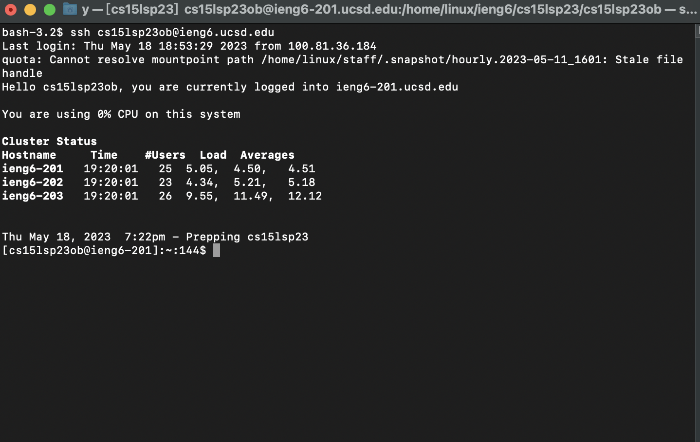
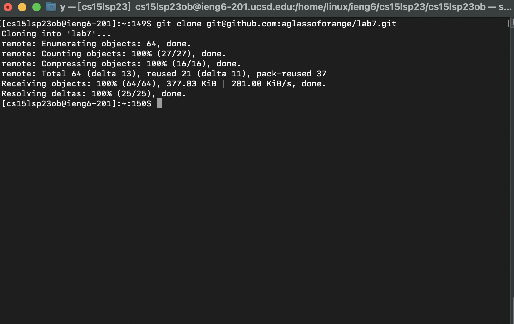
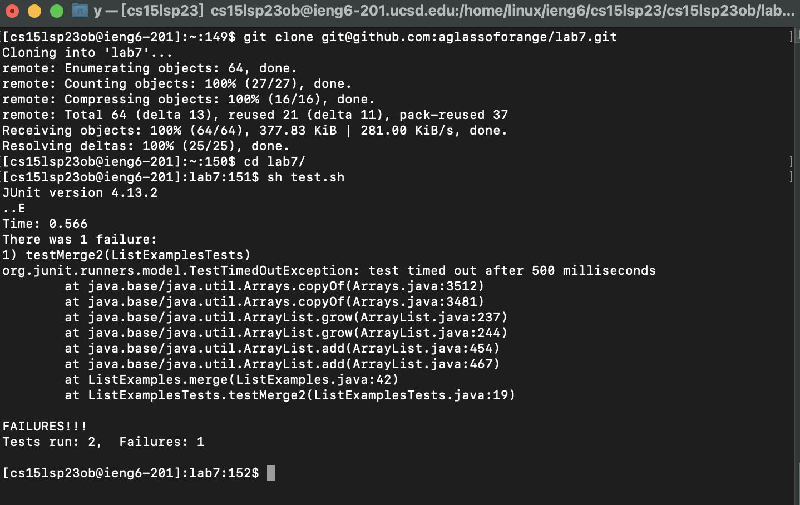
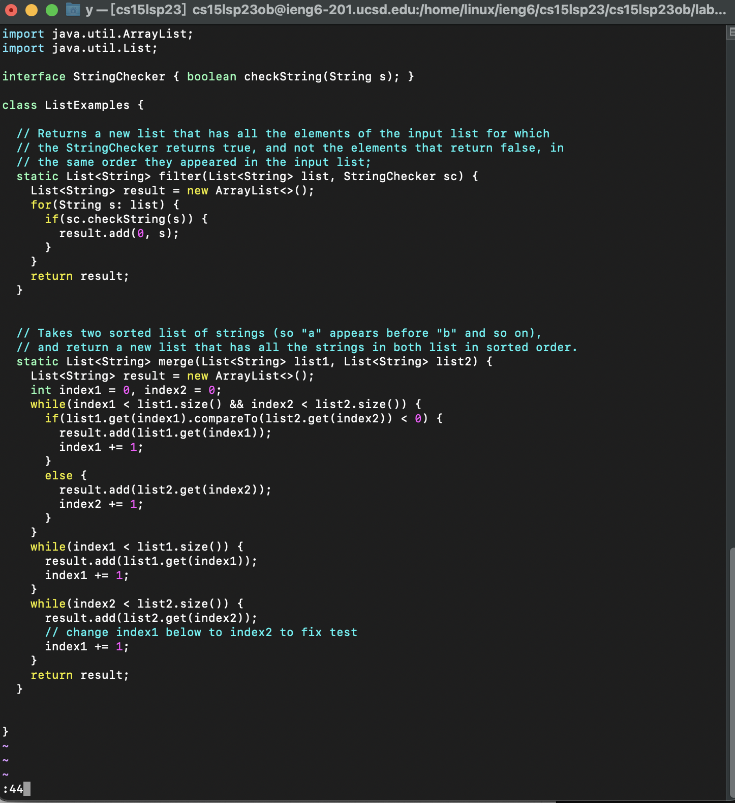
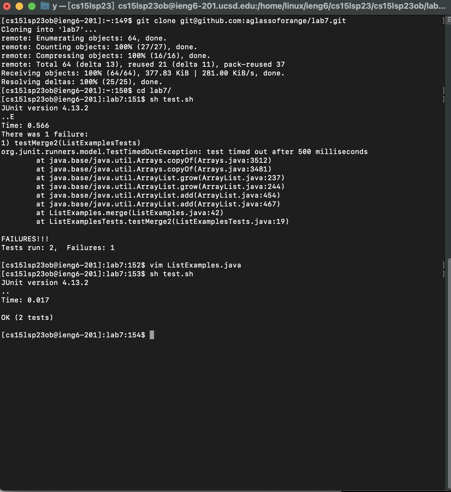
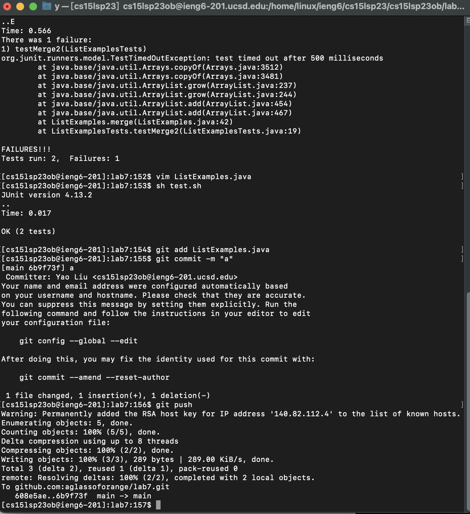

* Log into ieng6 <br />
 ```
Keys pressed: ssh<space>cs15lsp23ob@ieng6.ucsd.edu<enter>
 ```
 ```
Because we generated SSH keys for ieng6. 
 ```
 ```
We don't need to type the password to log in to the server.
 ```


* Clone your fork of the repository from your Github account<br />


go to github, and press ssh categroy and copy the link.
SSH is better because I have set up SSH key during class,
and I don't need to input the password.
Keys pressed: git clone git@github.com:aglassoforange/lab7.git<enter>




* Run the tests, demonstrating that they fail <br />


cd lab7: go to the driectory lab7.
running the test script
Key pressed:sh test.sh<enter>



* change ListExamples.java's code
 ```
Key pressed:vim ListExamples.java<Enter> 
enter line 44：
<esc>:44 
get to character "1":
<l><l><l><l><l> move cursor to right
change "1" to "2":
r2
save file:
<esc>:wq <enter>
```

* retest the code:

runing the test script
Key pressed:sh test.sh<enter>



* update changes to github, I don't need to input the password:

Key pressed:git add ListExamples.java<enter>
git push<enter>
git push command is to upload local commits to remote repository, 
and it is the repository in my github account. Since I do sure about the existence of the repository.
I didn't add -u flags or origin main to indicate the repository and branch name.
Everything I modified will be uploaded to defualt branch and repository which are lab7 and main branch.


